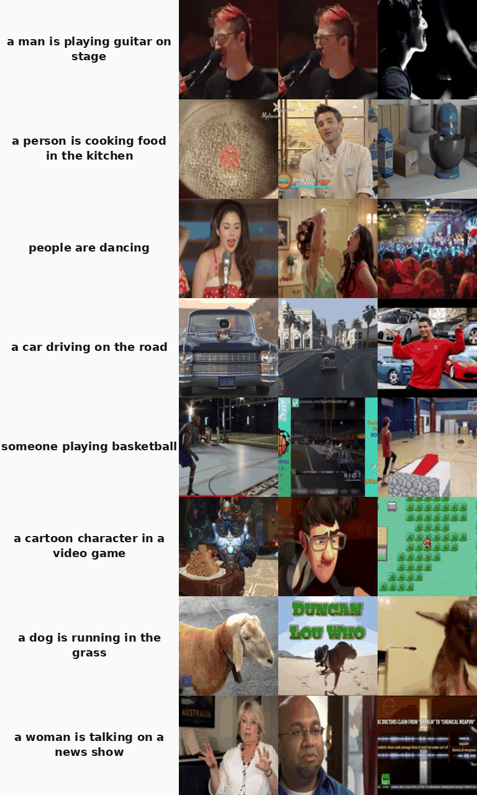

# Open-VLJEPA

[](https://huggingface.co/cun-bjy/open-vljepa)
[](https://arxiv.org/abs/2512.10942)
[](#license--attribution)
[](https://paypal.me/JunyeobBaek)

Open re-implementation of [**VL-JEPA: Joint Embedding Predictive Architecture for Vision-Language**](https://arxiv.org/abs/2512.10942) (Chen et al., 2026, Meta) — small-scale.

> **Note** — this is a *resource-poor* re-implementation. Training was limited to a single workstation (8 × RTX 4090, 192 GB VRAM total) over a few days, versus the paper's 192 × H200 for 4 weeks on ~3.3 B samples. Numbers below reflect that gap.
>
> My work runs on caffeine ☕. If this repo is useful to you, [**a small donation**](https://paypal.me/JunyeobBaek) helps keep the lights on and more open re-implementations coming.

V-JEPA 2 (frozen) → 8-layer Llama-3.2 predictor → contrastive prediction of EmbeddingGemma text embeddings.

## Architecture

| Component | Module | Params | Frozen? |
|---|---|---|---|
| **X-Encoder** | `facebook/vjepa2-vitl-fpc64-256` | 304 M | ✓ frozen |
| **Predictor** | last 8 layers of `meta-llama/Llama-3.2-1B` + projection | 490 M | trainable |
| **Y-Encoder** | `google/embeddinggemma-300m` + projection | ~310 M | trainable (slow LR ×0.05) |
| **Loss** | bi-directional InfoNCE, τ = 0.07, all-gather pool | — | — |

Shared embedding space: **1536 D**. Total trainable: ~800 M.

## Demo

Text → video retrieval on MSRVTT test (best ckpt, MSRVTT-only Stage B, **R@1 = 23.9** on 500-pool):



Reproduce — download the trained checkpoint from [HuggingFace](https://huggingface.co/cun-bjy/open-vljepa) and run the demo:
```bash
huggingface-cli download cun-bjy/open-vljepa best.pt --local-dir checkpoints_msrvtt
python scripts/demo_gif.py --ckpt checkpoints_msrvtt/best.pt
```

## Results (T2V Retrieval, MSRVTT test, 500-video pool)

| Setup | Training data | Epochs | best R@1 | R@5 | R@10 |
|---|---|---|---|---|---|
| Paper VL-JEPA_BASE (reference) | Datacomp+YFCC-100M + Action100M (~3.3B samples) | — | **51.6** | — | — |
| Stage A only (image-text init, 1 frame) | CC3M ~1M | 10 | 6.77 | 19.2 | 26.8 |
| **In-domain Stage B** | MSRVTT 140K (init from Stage A) | 50 | **23.90** | **51.4** | **65.1** |
| **Zero-shot Stage B** (no MSRVTT in train) | WebVid 1.78M (init from Stage A) | 15+ | **13.74 (ep2 peak)** | 31.5 | 42.1 |

### Key takeaways

- **In-domain MSRVTT finetune** reaches R@1 = 23.9 at our scale (50 ep, 8 × RTX 4090).
- **Zero-shot ceiling ~14 R@1** with 1.78M WebVid — well below paper VL-JEPA_BASE (51.6 on 3.3B samples of diverse web data).
- **Domain match > raw scale** when training data is small. WebVid is stock footage (Shutterstock); MSRVTT is YouTube clips — different distribution. Paper's Action100M (HowTo100M-derived) overlaps MSRVTT better.

## Setup

```bash
conda create -n openvljepa python=3.10 -y
conda activate openvljepa
pip install torch torchvision --index-url https://download.pytorch.org/whl/cu121
pip install transformers datasets huggingface-hub peft pyyaml decord webdataset imageio pillow matplotlib
```

Hardware used: 8 × RTX 4090 (24 GB each), bf16 + gradient checkpointing.

## Training

Both recipes share **Stage A → Stage B** structure. Stage A establishes vision–text alignment on still images; Stage B extends it to 8-frame video.

### Stage A — image-text pretraining

Train predictor + y_encoder on CC3M (~1 M image-caption pairs), with each image fed as a 1-frame "video" so the V-JEPA encoder treats it uniformly. 10 epochs, ~4 h on 8 × RTX 4090. This stage alone reaches R@1 ≈ 6.8 on MSRVTT 500-pool — a vision-only init that already grounds the text encoder.

```bash
torchrun --nproc_per_node=8 scripts/train.py --config configs/stage_a.yaml
```

Produces `checkpoints_stage_a/best.pt`, used as `init_from` for both Stage B recipes below.

### Stage B — video-text training (init from Stage A)

**(a) In-domain MSRVTT** — 50 epochs on MSRVTT only. Reaches R@1 = 23.9.
```bash
torchrun --nproc_per_node=8 scripts/train.py --config configs/stage_b_retrain.yaml
```

**(b) Zero-shot** — WebVid-only Stage B (MSRVTT never seen in training). R@1 peaks at 13.7 around epoch 2 then plateaus due to domain mismatch.
```bash
torchrun --nproc_per_node=8 scripts/train.py --config configs/stage_b_webvid_v2.yaml
```

Shared training settings:
- bs = 64 per GPU × 8 GPUs = effective contrastive pool of 512 via all-gather
- LR 1e-4 predictor, 5e-6 Y-Encoder (×0.05), warmup-constant schedule, 2 000 warmup steps
- gradient checkpointing on predictor + y_encoder (essential for bs=64 with 8 frames @ 256²)

## Eval

```bash
python scripts/eval.py --ckpt checkpoints_stage_b_after_a/best.pt --n_videos 500
```

Also runs DDP eval at each epoch end during training (see `eval` section in any config).

## Data

| Dataset | Where | Notes |
|---|---|---|
| MSRVTT | `data/msrvtt/` (annotations + videos via `friedrichor/MSR-VTT`) | 10K videos, ~200K caption-video pairs |
| CC3M | `/data/.../cc3m-wds/` (Stage A image-text) | webdataset format, ~1M pairs after download |
| WebVid-2M | `/data/.../webvid/videos/` (downloaded via `video2dataset`) | ~1.78M usable pairs (95% of 2M target) |

Run `scripts/redownload_msrvtt_videos.sh` to fetch MSRVTT test videos from HuggingFace if you only have annotations.

## Limitations (honest)

- **R@1 23.9 vs paper 51.6**: paper trained on ~3.3B samples (Datacomp + YFCC + Action100M) with 192 H200 GPUs for 4 weeks. We trained on 0.14–1.8 M samples with 8 RTX 4090. Gap is data scale, not architecture.
- **WebVid as zero-shot pretrain is narrow**: stock footage (Shutterstock), poor overlap with MSRVTT YouTube clips. Paper's Action100M (HowTo100M-derived) overlaps better but is Meta-internal; HowTo100M itself needs `yt-dlp` on 1.2 M YouTube videos (days + dead links + 12+ TB disk).
- **`best.pt` tracks training loss, not R@1** — under zero-shot training, loss keeps dropping while MSRVTT R@1 peaks early and declines. Track R@1 explicitly for downstream-aligned eval.

## License & Attribution

Built with **Llama** (`meta-llama/Llama-3.2-1B`, [Llama 3.2 Community License](https://huggingface.co/meta-llama/Llama-3.2-1B/blob/main/LICENSE)) and **Gemma** (`google/embeddinggemma-300m`, [Gemma License](https://ai.google.dev/gemma/terms)). V-JEPA 2 (`facebook/vjepa2-vitl-fpc64-256`, MIT) is used in frozen form. By using the trained checkpoint you agree to both Llama 3.2 and Gemma Acceptable Use Policies.

## Citation

Cite the original paper:

```bibtex
@article{chen2026vljepa,
  title   = {VL-JEPA: Joint Embedding Predictive Architecture for Vision-Language},
  author  = {Chen et al.},
  journal = {arXiv preprint arXiv:2512.10942},
  year    = {2026}
}
```

If this repo or its experiments are useful, you can also cite the implementation:

```bibtex
@misc{openvljepa2026,
  title        = {Open-VLJEPA: a small-scale open re-implementation of VL-JEPA},
  author       = {Baek, Junyeob},
  year         = {2026},
  howpublished = {\url{https://github.com/dion-jy/openvl-jepa}},
  note         = {GitHub repository}
}
```
